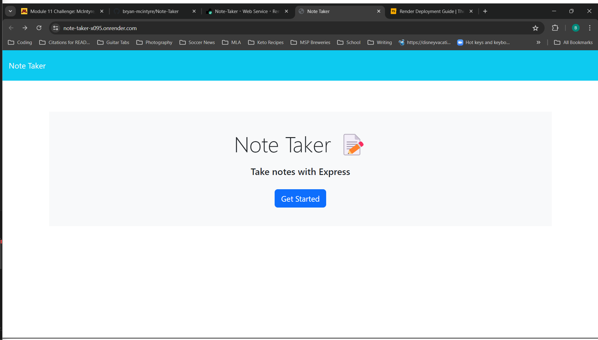
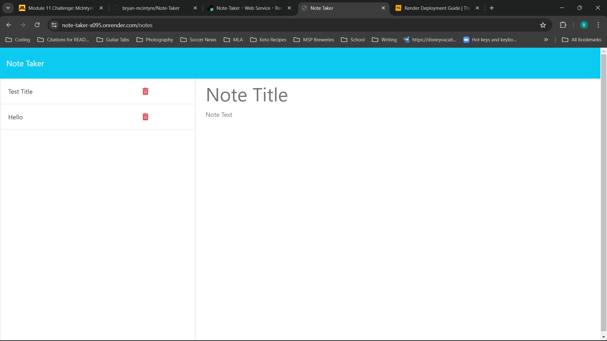

# Note-Taker

## Table of Contents
- [Description](#description)
- [Installation](#installation)
- [Usage](#usage)
- [Future Development](#future-development)
- [Issues](#issues)
- [Credits](#credits)

## Description
Note Taker is a web appliction that lets a user create and save notes to help with running their small business.

## Installation
Visit this link: https://note-taker-x095.onrender.com

## Usage
To use the appliction click the Get Started button on the homepage: 

On the left-hand side of the screen you'll be presented with a list of already created notes and next to that a place to create a new note as shown here , 

Once the new note is added, it will appear in the list on the left: 

## Future Development
In the future a 'delete' option will be added to allow the user to delete notes in addition to adding them.

## Issues
N/A

## Credits
To build this application I referenced code from the week 11 curriculum, including the solved Mini-Project. 